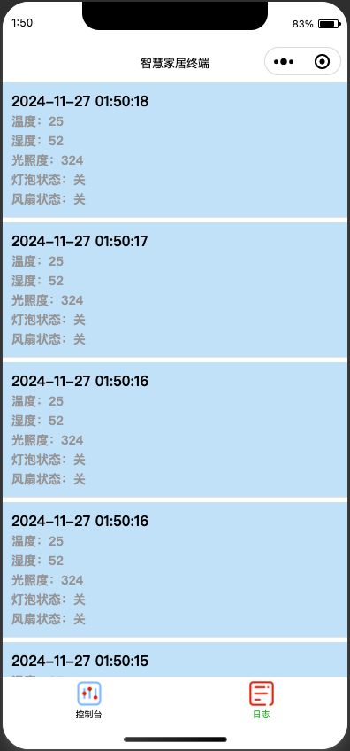

# EI8702_课程作业 智慧家居
EI8702 物联网技术, 课程作业，2024 秋, 上海交通大学

小组成员: 宁振宇, 王旭, 董文韬, 王政, 陈嘉轩

## 代码结构
- `bearpi-hm_nano` 包含BearPi-HM_Nano 开发版相关的代码与资源，本项目基于华为[小熊派官方开源代码仓库](https://gitee.com/bearpi/bearpi-hm_nano.git), 删去无关第三方软件包，基于案例D6修改得到。
- `SmartHomeApp` 包含微信小程序的开发代码，其作为应用端与云端交互，俱有访问获取开发版数据、控制开发版运行状态的功能。
  
## 部署方式
- 在鸿蒙小熊派虚拟机中，修改`bearpi-hm_nano/applications/BearPi/BearPi-HM_Nano/sample/D6_iot_cloud_oc/iot_cloud_oc_sample.c` 文件中第`40`-`42`行MQTT 客户端相关登陆参数，第`238`行无线网络连接相关参数。
- 进入`bearpi-hm_nano`目录，执行 
```shell
python build.py BearPi-HM_Nano
```
- 使用`Hiburn`等工具将`out/BearPi-HM_Nano/Hi3861_wifiiot_app_allinone.bin`烧入板内。
- 使用[微信开发者工具](https://developers.weixin.qq.com/miniprogram/dev/devtools/download.html)导入`SmartHomeApp`小程序。待初始化完成后使用按钮与华为云平台进行交互。

## 释例图片


